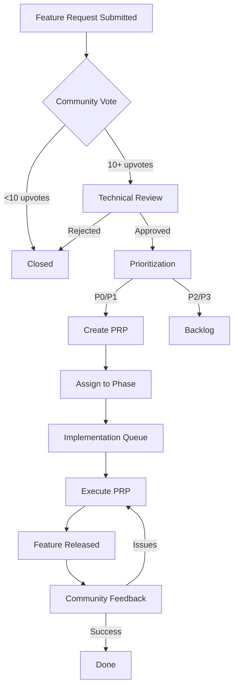

# Edge Craft Feature Request Framework

## 🎯 Purpose

This framework provides a **structured process for community feature requests**, ensuring alignment with project goals, legal compliance, and technical feasibility. It integrates with our PRP (Project Requirement Proposal) workflow and supports transparent prioritization.

---

## 📋 Feature Request Template

### Use this template when submitting feature requests to Edge Craft

```markdown
# Feature Request: [Feature Name]

## 📝 Summary
<!-- One sentence describing the feature -->

## 🎯 Problem Statement
<!-- What problem does this solve? Why is it needed? -->

## 💡 Proposed Solution
<!-- Describe your proposed implementation -->

## 🎮 User Story
<!-- As a [user type], I want [feature] so that [benefit] -->

## 📊 Impact Assessment

### User Value (High/Medium/Low)
<!-- How many users benefit? How much impact on gameplay? -->

### Alignment with Project Vision (High/Medium/Low)
<!-- Does this fit Edge Craft's goals? (RTS, browser-based, legal) -->

### Technical Complexity (High/Medium/Low)
<!-- How hard to implement? Estimate effort in days/weeks -->

## 🛡️ Legal & Compliance

### Copyright Considerations
- [ ] Feature uses only original/CC0/MIT assets
- [ ] No copyrighted game mechanics (or explain how to avoid)
- [ ] DMCA compliance strategy documented

### Patent Check
- [ ] No known patent conflicts
- [ ] Prior art research conducted (if applicable)

## 🔧 Technical Feasibility

### Dependencies
<!-- List required systems/PRPs -->

### Browser Compatibility
<!-- Works on Chrome/Firefox/Safari/Edge? -->

### Performance Impact
<!-- Estimated FPS impact, memory usage, etc. -->

### Mobile Compatibility
<!-- Does it work on tablets/phones? -->

## 📅 Suggested Phase
<!-- Which phase should this be implemented in? (0-11) -->

## 🔗 Related Features
<!-- Links to similar features, PRPs, or issues -->

## 📸 Mockups/Examples
<!-- Screenshots, diagrams, or reference implementations -->

## 🎨 Alternatives Considered
<!-- Other ways to solve the same problem -->

## ✅ Acceptance Criteria
<!-- How do we know when this is "done"? -->
- [ ] Criterion 1
- [ ] Criterion 2
- [ ] Criterion 3

## 📚 References
<!-- Links to relevant documentation, research, etc. -->

---

**Submitted by**: [Your Name/GitHub Username]
**Date**: YYYY-MM-DD
**Contact**: [Email/Discord] (optional)
```

---

## 🔄 Feature Request Lifecycle

### 1. **Submission** 📥
User submits feature request via:
- GitHub Issues (with `feature-request` label)
- Discord #feature-requests channel
- Community forum thread

**Automated Actions**:
- Template validation (all sections filled)
- Auto-label based on suggested phase
- Add to community voting board

---

### 2. **Community Validation** 🗳️
**Duration**: 7 days minimum

Community members:
- Upvote/downvote the request
- Comment with use cases and feedback
- Suggest improvements or alternatives

**Metrics Tracked**:
- Upvotes/downvotes
- Comment engagement
- Discussion quality

**Threshold for Advancement**:
- **10+ net upvotes** OR
- **Strong justification from core team**

---

### 3. **Technical Review** 🔍
**Owner**: Core development team
**Duration**: 3-5 days

Review criteria:
- [ ] **Legal Compliance**: No copyright/patent issues
- [ ] **Technical Feasibility**: Can be implemented in Edge Craft
- [ ] **Performance Impact**: Won't break 60 FPS target
- [ ] **Scope Fit**: Aligns with project roadmap
- [ ] **Effort Estimate**: Realistic timeline (hours/days/weeks)

**Outcomes**:
- ✅ **Approved**: Move to prioritization
- ⏸️ **Deferred**: Good idea, wrong phase (add to backlog)
- 🔄 **Needs Refinement**: Request more details
- ❌ **Rejected**: Explain why (legal, technical, scope)

---

### 4. **Prioritization** 📊
**Owner**: Product manager + Core team
**Method**: Weighted scoring system

### Scoring Matrix

| Criteria | Weight | Score (1-10) | Weighted Score |
|----------|--------|--------------|----------------|
| **User Value** | 30% | | |
| **Alignment with Vision** | 25% | | |
| **Technical Feasibility** | 20% | | |
| **Community Support** | 15% | | |
| **Effort (inverse)** | 10% | | |

**Formulas**:
- **User Value**: (Upvotes × 0.3) + (Active users affected × 0.7)
- **Alignment**: Manual score (1=off-vision, 10=core feature)
- **Feasibility**: (10 - complexity score)
- **Community Support**: (Net upvotes / 10) capped at 10
- **Effort (inverse)**: (10 - (estimated days / 5)) capped at 1

**Total Score**: Sum of weighted scores (max 10.0)

**Priority Tiers**:
- **P0 (Critical)**: Score 8.0+ → Next sprint
- **P1 (High)**: Score 6.0-7.9 → Next phase
- **P2 (Medium)**: Score 4.0-5.9 → Backlog
- **P3 (Low)**: Score <4.0 → Deferred/Rejected

---

### 5. **PRP Creation** 📝
**Owner**: Assigned developer
**For**: P0 and P1 features only

Convert approved feature request to PRP:
1. Create PRP file in `PRPs/phase{X}-{category}/`
2. Follow PRP template structure
3. Define DoR (Definition of Ready)
4. Define DoD (Definition of Done)
5. Estimate effort and dependencies
6. Add to roadmap timeline

**PRP Template Mapping**:
```
Feature Request Section → PRP Section
━━━━━━━━━━━━━━━━━━━━━━━━━━━━━━━━━━━━━━
Summary                 → Overview
Problem Statement       → Context & Motivation
Proposed Solution       → Technical Specification
User Story              → User Requirements
Impact Assessment       → Success Metrics
Legal & Compliance      → Legal Compliance Section
Technical Feasibility   → Implementation Plan
Acceptance Criteria     → Definition of Done
```

---

### 6. **Implementation** ⚙️
**Owner**: Development team

Follow standard PRP execution workflow:
1. Pass DoR checklist
2. Implement feature
3. Write tests (>80% coverage)
4. Run validation gates
5. Code review
6. Pass DoD checklist
7. Merge to main

---

### 7. **Community Feedback** 🎉
**After Release**:
- Announce feature in changelog
- Tag original requester
- Collect feedback (did it solve the problem?)
- Iterate if needed

---

## 🏆 Feature Request Categories

### Category 1: Gameplay Features
**Examples**: New unit types, abilities, game modes
**Review Focus**: Balance, legal compliance, fun factor
**Typical Phase**: 6-10

### Category 2: Editor Tools
**Examples**: Terrain tools, trigger editor, asset browser
**Review Focus**: UX, workflow efficiency, power-user needs
**Typical Phase**: 8

### Category 3: Multiplayer Features
**Examples**: Matchmaking, lobbies, replays, spectator mode
**Review Focus**: Scalability, latency, anti-cheat
**Typical Phase**: 9

### Category 4: Rendering & Visual
**Examples**: Post-processing, effects, shaders, lighting
**Review Focus**: Performance impact, artistic direction
**Typical Phase**: 2, 10

### Category 5: Asset Pipeline
**Examples**: Format support, conversion tools, validators
**Review Focus**: Legal compliance, format coverage
**Typical Phase**: 4-5

### Category 6: Infrastructure
**Examples**: Build tools, CI/CD, testing frameworks
**Review Focus**: Developer productivity, code quality
**Typical Phase**: 0-1

### Category 7: Community Tools
**Examples**: Mod support, workshop, documentation
**Review Focus**: Community growth, accessibility
**Typical Phase**: 10-11

---

## 📊 Prioritization Examples

### Example 1: Replay System

| Criteria | Weight | Score | Weighted | Reasoning |
|----------|--------|-------|----------|-----------|
| User Value | 30% | 9 | 2.7 | All competitive players want this |
| Alignment | 25% | 10 | 2.5 | Core RTS feature |
| Feasibility | 20% | 6 | 1.2 | Moderately complex (deterministic sim) |
| Community | 15% | 8 | 1.2 | 80 upvotes |
| Effort (inv) | 10% | 5 | 0.5 | ~5 days work |
| **Total** | | | **8.1** | **P0 - Critical** |

**Decision**: Implement in Phase 9 (Multiplayer)

---

### Example 2: Custom UI Themes

| Criteria | Weight | Score | Weighted | Reasoning |
|----------|--------|-------|----------|-----------|
| User Value | 30% | 4 | 1.2 | Nice-to-have, not essential |
| Alignment | 25% | 5 | 1.25 | Tangentially related (polish) |
| Feasibility | 20% | 9 | 1.8 | Easy (CSS variables) |
| Community | 15% | 6 | 0.9 | 15 upvotes |
| Effort (inv) | 10% | 9 | 0.9 | ~1 day work |
| **Total** | | | **6.05** | **P1 - High** |

**Decision**: Add to Phase 10 (Advanced Features) backlog

---

### Example 3: Import Blizzard Campaign Maps

| Criteria | Weight | Score | Weighted | Reasoning |
|----------|--------|-------|----------|-----------|
| User Value | 30% | 10 | 3.0 | HUGE demand |
| Alignment | 25% | 2 | 0.5 | **LEGAL RISK** |
| Feasibility | 20% | 8 | 1.6 | Technically possible |
| Community | 15% | 10 | 1.5 | 200 upvotes |
| Effort (inv) | 10% | 6 | 0.6 | ~4 days work |
| **Total** | | | **7.2** | **REJECTED (Legal)** |

**Decision**: ❌ Reject due to copyright (campaigns are copyrighted content)
**Alternative**: Support custom campaigns with original assets

---

## 🚨 Auto-Rejection Criteria

Features are **automatically rejected** if they:

### Legal Violations
- ❌ Use copyrighted Blizzard assets (models, textures, sounds)
- ❌ Violate known patents
- ❌ Require reverse engineering (not clean-room)
- ❌ Include trademarked names/branding

### Technical Impossibilities
- ❌ Require server-side processing (browser-only architecture)
- ❌ Break cross-platform compatibility
- ❌ Require <60 FPS target violation
- ❌ Need non-WebGL technologies

### Scope Violations
- ❌ Not related to RTS gameplay or engine
- ❌ Better suited as external mod/plugin
- ❌ Duplicate existing features
- ❌ Against project philosophy (e.g., pay-to-win)

---

## 🔧 Integration with PRP Workflow

### Feature Request → PRP Conversion Process



### PRP Filename Convention
```
PRPs/phase{N}-{category}/{N}.{ID}-{feature-name}.md

Example:
PRPs/phase9-multiplayer/9.14-replay-system.md
                          ↑   ↑   ↑
                       Phase  ID  Feature Name
```

---

## 🎮 Community Engagement Strategy

### Transparency Principles
1. **All feature requests are public** (GitHub Issues)
2. **Voting results are visible** (upvote counts)
3. **Rejection reasons are documented** (issue comments)
4. **Implementation progress is tracked** (PRP status)
5. **Release notes credit requesters** (thank contributors)

### Communication Channels
- **GitHub Issues**: Official tracking
- **Discord #feature-requests**: Discussion
- **Monthly Dev Blog**: Feature request roundup
- **Quarterly Roadmap Update**: Community vote on priorities

### Recognition System
- **Feature Champion Badge**: Request implemented
- **Top Contributor**: Most upvoted requests
- **Hall of Fame**: Impactful features (>100 upvotes)

---

## 📈 Metrics & KPIs

### Track these metrics monthly:

| Metric | Target | Measurement |
|--------|--------|-------------|
| Feature requests submitted | 20+/month | GitHub Issues count |
| Average response time | <3 days | First comment timestamp |
| Approval rate | 30-40% | Approved / Total |
| Community satisfaction | >70% | Post-release surveys |
| Implementation rate (P0) | 100% | Implemented / Approved |
| Implementation rate (P1) | 60%+ | Implemented / Approved |

---

## 🛠️ Tools & Automation

### GitHub Setup
```yaml
# .github/ISSUE_TEMPLATE/feature_request.md
name: Feature Request
about: Suggest a new feature for Edge Craft
labels: feature-request, needs-review
assignees: ''
```

### Automated Workflows
1. **Label Bot**: Auto-label based on category keywords
2. **Voting Bot**: Track upvotes, update priority
3. **Stale Bot**: Close inactive requests after 90 days
4. **Duplicate Detector**: Flag similar requests

### Community Dashboard
- **Live voting board** (https://features.edgecraft.game)
- **Roadmap view** with community requests
- **Request status tracker** (submitted → implemented)

---

## 🎓 Best Practices for Requesters

### ✅ DO:
- **Be specific**: "Add unit formations" not "make units better"
- **Explain the why**: Problem statement is critical
- **Check for duplicates**: Search existing requests first
- **Provide examples**: Screenshots, videos, or references
- **Consider legal**: Think about copyright implications
- **Engage in discussion**: Respond to feedback

### ❌ DON'T:
- **Request copyrighted content**: "Add Arthas model"
- **Be vague**: "Make game more fun"
- **Demand immediate implementation**: Respect roadmap
- **Duplicate requests**: Use upvotes on existing ones
- **Argue if rejected**: Accept technical/legal limitations

---

## 📚 Feature Request Resources

### For Requesters
- [Feature Request Template](../ISSUE_TEMPLATE/feature_request.md)
- [Legal Guidelines](./LEGAL.md)
- [Roadmap Overview](./ROADMAP.md)
- [Technical Architecture](./ARCHITECTURE.md)

### For Reviewers
- [PRP Template](./PRPs/templates/prp_base.md)
- [Prioritization Spreadsheet](./docs/feature-prioritization.xlsx)
- [Legal Compliance Checklist](./INITIAL.md#legal-compliance-gate)

### For Developers
- [PRP Execution Guide](./PRPs/README.md)
- [Testing Requirements](./CONTRIBUTING.md#testing)
- [DoD Checklist](./INITIAL.md#definition-of-done)

---

## 🔄 Framework Evolution

This framework will be reviewed and updated:
- **After each phase completion** (lessons learned)
- **Quarterly community feedback sessions**
- **When process bottlenecks are identified**

Proposed changes will be discussed in:
- GitHub Discussions
- Discord #meta channel
- Monthly contributor calls

---

## 🚀 Getting Started

### Submit Your First Feature Request
1. Go to https://github.com/your-org/edgecraft/issues/new
2. Choose "Feature Request" template
3. Fill out all sections thoroughly
4. Submit and engage with community feedback

### Review Existing Requests
1. Browse https://github.com/your-org/edgecraft/labels/feature-request
2. Upvote requests you support
3. Comment with use cases or suggestions
4. Help refine vague requests

### Become a Reviewer
1. Demonstrate technical knowledge
2. Contribute 5+ quality reviews
3. Apply for reviewer role in Discord
4. Get invited to core team meetings

---

**This framework ensures Edge Craft grows with its community while maintaining legal compliance, technical quality, and project vision alignment.** 🎮✨
