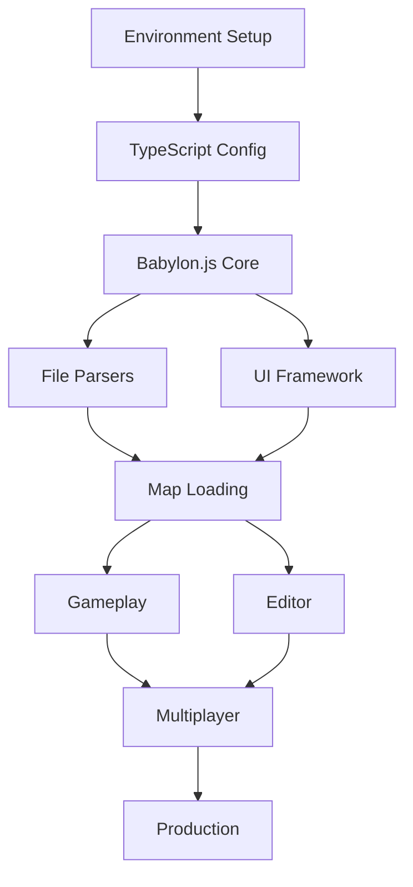

# Edge Craft - Auto-Heal Context & Compliance System

## 🚨 CRITICAL: THIS IS YOUR COMPLIANCE BIBLE 🚨
This document serves as an **AUTO-HEAL INSTRUCTION SYSTEM** that ensures all PRPs, code, and decisions comply with stakeholder-agreed requirements. **EVERY ACTION MUST BE VALIDATED AGAINST THIS DOCUMENT**.

## PROJECT ESSENCE
Edge Craft is a legally-compliant WebGL RTS engine that enables users to experience classic RTS gameplay through **clean-room implementation**, **original assets**, and **robust file format support** while maintaining **strict DMCA compliance**.

## 🔗 CRITICAL EXTERNAL DEPENDENCIES
**⚠️ MANDATORY: These repositories are REQUIRED for full functionality:**

### 1. Multiplayer Server: `core-edge`
- **Repository**: https://github.com/uz0/core-edge
- **Purpose**: Authoritative multiplayer server implementation
- **Integration**: All multiplayer PRPs MUST reference this repository
- **Local Dev**: Use mock server until core-edge integration

### 2. Default Launcher Map: `index.edgecraft`
- **Repository**: https://github.com/uz0/index.edgecraft
- **Purpose**: Advanced launcher/menu map with network features
- **Path**: Always loads from `/maps/index.edgecraft` on startup
- **Local Dev**: Use simplified mock launcher map

## 🔴 MANDATORY COMPLIANCE CHECKLIST (AUTO-HEAL)
**Before starting ANY work, validate against ALL criteria:**

### Legal Compliance Gate ⚖️
- [ ] **NO copyrighted assets** from Blizzard (textures, models, sounds, icons)
- [ ] **Clean-room implementation** only (no decompiled/reverse-engineered code)
- [ ] **DMCA Section 1201(f)** interoperability provisions documented
- [ ] **Asset replacement strategy** defined (CC0/MIT alternatives)
- [ ] **License headers** on all source files
- [ ] **Attribution file** updated for any third-party code

### Technical Architecture Gate 🏗️
- [ ] **CASC-based custom format** (.edgestory/.edgemap) as primary
- [ ] **TypeScript API** with strict typing (no 'any')
- [ ] **Babylon.js patterns** for all rendering
- [ ] **React functional components** with hooks
- [ ] **Colyseus** for multiplayer (WebSocket-based)
- [ ] **Progressive loading** for large assets
- [ ] **External repo integration** for core-edge server
- [ ] **Default launcher** loads /maps/index.edgecraft
- [ ] **Mock implementations** for local development

### Performance Gate 🚀
- [ ] **60 FPS** with 500 units on screen
- [ ] **< 10 second** map load time
- [ ] **< 2GB memory** for large maps
- [ ] **< 100ms network latency** for multiplayer
- [ ] **No memory leaks** in 1-hour sessions
- [ ] **WebGL fallback** for older devices

### Quality Gate ✅
- [ ] **95% W3/SC map compatibility** (measured by successful load)
- [ ] **Unit tests** with >80% coverage
- [ ] **Integration tests** for file parsers
- [ ] **Performance benchmarks** passing
- [ ] **Cross-browser testing** (Chrome, Firefox, Safari, Edge)
- [ ] **Mobile responsiveness** for UI components

## 📋 DEFINITION OF READY (DoR) - PRP Prerequisites
**A PRP cannot start unless:**

### Research Requirements
1. **Competitor Analysis Completed**:
   - [ ] SC2 Arcade limitations documented
   - [ ] W3Champions features analyzed
   - [ ] Unity RTS frameworks evaluated
   - [ ] Performance benchmarks from competitors

2. **Tool Evaluation Documented**:
   - [ ] Babylon.js vs Three.js comparison
   - [ ] Colyseus vs Socket.io analysis
   - [ ] Build tool performance (Vite vs Webpack)
   - [ ] Testing framework selection rationale

3. **Legal Risk Assessment**:
   - [ ] Patent search for relevant technologies
   - [ ] DMCA compliance strategy defined
   - [ ] Asset sourcing plan documented
   - [ ] Terms of Service reviewed

4. **Technical Feasibility**:
   - [ ] Proof of concept validated
   - [ ] Performance impact estimated
   - [ ] Browser compatibility confirmed
   - [ ] Dependencies security-audited

## 📋 DEFINITION OF DONE (DoD) - PRP Completion
**A PRP is NOT complete unless:**

### Code Quality
- [ ] TypeScript strict mode passing
- [ ] ESLint/Prettier formatting applied
- [ ] No console.log statements
- [ ] Error boundaries implemented
- [ ] Loading states handled
- [ ] Memory cleanup verified

### Testing
- [ ] Unit tests written (>80% coverage)
- [ ] Integration tests passing
- [ ] E2E tests for critical paths
- [ ] Performance benchmarks met
- [ ] Cross-browser tested
- [ ] Memory leak testing passed

### Documentation
- [ ] JSDoc comments on public APIs
- [ ] README updated with new features
- [ ] Architecture diagrams current
- [ ] Deployment guide updated
- [ ] Troubleshooting guide expanded

### Legal
- [ ] No copyrighted content
- [ ] Licenses documented
- [ ] Attribution updated
- [ ] DMCA compliance verified
- [ ] Patents checked

## 🏛️ ARCHITECTURAL REQUIREMENTS

### External Repository Integration Pattern (CRITICAL)
```typescript
// MANDATORY: External repository references
interface ExternalDependencies {
  multiplayerServer: {
    repo: 'https://github.com/uz0/core-edge';
    localMock: './mocks/multiplayer-server';
    integration: 'Colyseus client → core-edge server';
  };

  defaultLauncher: {
    repo: 'https://github.com/uz0/index.edgecraft';
    path: '/maps/index.edgecraft';
    localMock: './mocks/launcher-map/index.edgecraft';
    autoLoad: true; // ALWAYS loads on startup
  };
}

// Development vs Production
const config = {
  development: {
    server: 'http://localhost:2567', // Local mock
    launcher: './mocks/launcher-map/index.edgecraft'
  },
  production: {
    server: 'wss://core-edge.edgecraft.game',
    launcher: 'https://github.com/uz0/index.edgecraft/releases/latest'
  }
};
```

### File Format Strategy (CRITICAL)
```typescript
// Primary: Custom CASC-based format
interface EdgeFormat {
  container: '.edgestory' | '.edgemap' | '.edgecraft';
  encoding: 'CASC-style chunked';
  manifest: 'JSON metadata';
  assets: 'glTF 2.0 for models';
  scripts: 'TypeScript (transpiled from JASS/Galaxy)';
  launcher: 'index.edgecraft'; // Default entry point
}

// Secondary: Import support for legacy
interface LegacySupport {
  warcraft3: ['.w3m', '.w3x', 'MDX models'];
  starcraft: ['.scm', '.scx', 'M3 models'];
  conversion: 'On-the-fly to EdgeFormat';
}
```

### Core Architecture Patterns
```typescript
// MANDATORY: Event-driven architecture
class GameEngine {
  private eventBus: EventEmitter;
  private renderer: BabylonRenderer;
  private gameLogic: GameSimulation;

  // Separation of concerns
  constructor() {
    this.eventBus.on('unit.move', this.handleMovement);
    this.eventBus.on('render.frame', this.updateGraphics);
  }
}

// MANDATORY: Resource pooling
class ResourceManager {
  private modelPool: Map<string, BABYLON.Mesh>;
  private textureCache: LRUCache<string, BABYLON.Texture>;

  // Prevent memory leaks
  dispose(): void {
    this.modelPool.forEach(mesh => mesh.dispose());
    this.textureCache.clear();
  }
}
```

## 🔍 COMPETITOR ANALYSIS REQUIREMENTS
**Every PRP must consider:**

### Direct Competitors
1. **SC2 Arcade**
   - Limitations: Locked to SC2 client, limited modding
   - Our advantage: Web-based, cross-platform, open

2. **W3Champions**
   - Limitations: Requires W3 Reforged
   - Our advantage: No base game required

3. **Unity RTS Frameworks**
   - Limitations: Heavy downloads, platform-specific
   - Our advantage: Instant web play, no installation

### Feature Parity Targets
- [ ] Map editor comparable to World Editor
- [ ] Trigger system as powerful as JASS/Galaxy
- [ ] Lobby system like Battle.net
- [ ] Replay system with observer mode
- [ ] Ranking/ladder system

## 🛠️ TOOL EVALUATION CRITERIA
**When selecting tools/libraries:**

### Performance Metrics
- Bundle size impact (< 100KB preferred)
- Runtime performance (benchmark required)
- Memory footprint
- Tree-shaking support
- CDN availability

### Community Health
- GitHub stars (> 1000 preferred)
- Recent commits (< 3 months)
- Issue response time (< 1 week)
- Documentation quality
- TypeScript support

### Legal Safety
- License compatibility (MIT/Apache preferred)
- Patent encumbrance check
- Corporate backing evaluation
- Security audit history

## 🚀 TECH STACK (IMMUTABLE)

### Core Technologies
```json
{
  "rendering": "@babylonjs/core ^7.0.0",
  "ui": "react ^18.2.0",
  "language": "typescript ^5.0.0",
  "multiplayer": "colyseus ^0.15.0",
  "build": "vite ^5.0.0",
  "testing": "jest ^29.0.0",
  "e2e": "playwright ^1.40.0"
}
```

### File Format Libraries
```json
{
  "mpq": "custom implementation (StormLib reference)",
  "casc": "custom implementation (CascLib reference)",
  "mdx": "custom parser (mdx-m3-viewer reference)",
  "m3": "custom parser (SC2 documentation)",
  "gltf": "@babylonjs/loaders"
}
```

## 🎯 SUCCESS METRICS (NON-NEGOTIABLE)

### Phase 0-3 (Foundation)
- [ ] Development environment < 5 min setup
- [ ] Build time < 10 seconds
- [ ] Test suite < 30 seconds
- [ ] Hot reload < 500ms

### Phase 4-7 (Core Features)
- [ ] 95% Warcraft 3 map compatibility
- [ ] 90% StarCraft map compatibility
- [ ] 500 concurrent units at 60 FPS
- [ ] < 10 second map load

### Phase 8-11 (Production)
- [ ] 99.9% uptime
- [ ] < 100ms game latency
- [ ] 10,000 concurrent users
- [ ] < 1% crash rate

## 🔄 VALIDATION COMMANDS (RUN BEFORE EVERY COMMIT)

```bash
# Comprehensive validation suite
npm run validate:all

# Individual checks
npm run validate:legal      # Copyright scan
npm run validate:types      # TypeScript strict
npm run validate:lint       # Code style
npm run validate:test       # Unit tests
npm run validate:e2e        # Integration tests
npm run validate:perf       # Performance benchmarks
npm run validate:security   # Dependency audit
npm run validate:bundle     # Size limits
```

## 🚨 CRITICAL GOTCHAS & SOLUTIONS

### Memory Management
```typescript
// WRONG: Memory leak
class Scene {
  meshes: BABYLON.Mesh[] = [];
  addMesh(mesh: BABYLON.Mesh) {
    this.meshes.push(mesh); // Never cleaned!
  }
}

// CORRECT: Proper cleanup
class Scene {
  meshes: Set<BABYLON.Mesh> = new Set();

  addMesh(mesh: BABYLON.Mesh) {
    this.meshes.add(mesh);
  }

  dispose() {
    this.meshes.forEach(m => m.dispose());
    this.meshes.clear();
  }
}
```

### Asset Loading
```typescript
// WRONG: Blocking load
const texture = loadTextureSync(url); // Blocks UI!

// CORRECT: Progressive loading
const texture = await loadTextureAsync(url);
const placeholder = getPlaceholderTexture();
mesh.material.diffuseTexture = placeholder;
texture.whenReady(() => {
  mesh.material.diffuseTexture = texture;
});
```

### Legal Compliance
```typescript
// WRONG: Using Blizzard assets
const orcModel = '/assets/orc_grunt.mdx'; // COPYRIGHT!

// CORRECT: Original assets
const orcModel = '/assets/original/warrior_01.gltf'; // CC0 licensed
```

## 📚 ESSENTIAL DOCUMENTATION

### Babylon.js
- Scene optimization: https://doc.babylonjs.com/features/featuresDeepDive/scene/optimize_your_scene
- Asset pipeline: https://doc.babylonjs.com/features/featuresDeepDive/importers/loadingFileTypes
- Performance: https://doc.babylonjs.com/features/featuresDeepDive/scene/optimizingYourScene

### File Formats
- MPQ Format: https://github.com/ladislav-zezula/StormLib/wiki/MPQ-Format
- CASC Format: https://wowdev.wiki/CASC
- MDX Format: https://github.com/flowtsohg/mdx-m3-viewer/blob/master/src/parsers/mdlx/README.md
- M3 Format: https://github.com/SC2Mapster/m3-specifications

### Legal Resources
- DMCA 1201(f): https://www.law.cornell.edu/uscode/text/17/1201
- Clean Room Design: https://en.wikipedia.org/wiki/Clean_room_design
- Game Cloning Law: https://www.gamasutra.com/view/feature/3030/clone_wars_the_five_most_important_.php

## 🤖 AVAILABLE SPECIALIST AGENTS

### Core Development
- `babylon-renderer` - WebGL/Babylon.js optimization
- `format-parser` - MPQ/CASC/MDX/M3 parsing
- `multiplayer-architect` - Colyseus/networking
- `legal-compliance` - DMCA/copyright validation

### Support Agents
- `asset-creator` - Original asset guidance
- `ui-designer` - React/TypeScript patterns
- `performance-optimizer` - Profiling and optimization
- `test-engineer` - Testing strategies

## 🔧 EXTERNAL REPOSITORY SETUP

### Setting Up Development Environment
```bash
# 1. Clone main Edge Craft repository
git clone https://github.com/[org]/edgecraft
cd edgecraft

# 2. Setup mock implementations
npm run setup:mocks

# 3. For multiplayer development:
# Clone core-edge server (separate terminal)
git clone https://github.com/uz0/core-edge ../core-edge
cd ../core-edge
npm install
npm run dev

# 4. For launcher map development:
# Clone index.edgecraft (separate workspace)
git clone https://github.com/uz0/index.edgecraft ../index.edgecraft
cd ../index.edgecraft
npm install
npm run build

# 5. Link launcher to main project
cd ../edgecraft
npm run link:launcher ../index.edgecraft/dist
```

### Mock Implementation Structure
```
edgecraft/
├── mocks/
│   ├── multiplayer-server/
│   │   ├── index.ts         # Mock Colyseus server
│   │   ├── rooms/           # Mock game rooms
│   │   └── README.md        # Points to core-edge
│   └── launcher-map/
│       ├── index.edgecraft  # Simplified launcher
│       ├── assets/          # Minimal UI assets
│       └── README.md        # Points to index.edgecraft
```

### Working with External Repos
```typescript
// src/config/external.ts
export const EXTERNAL_REPOS = {
  // For multiplayer PRPs
  MULTIPLAYER: {
    dev: 'http://localhost:2567',
    prod: 'https://api.core-edge.edgecraft.game',
    repo: 'https://github.com/uz0/core-edge',
    docs: 'https://github.com/uz0/core-edge/wiki'
  },

  // For launcher/menu PRPs
  LAUNCHER: {
    dev: './mocks/launcher-map/index.edgecraft',
    prod: 'https://cdn.edgecraft.game/maps/index.edgecraft',
    repo: 'https://github.com/uz0/index.edgecraft',
    autoLoad: true // ALWAYS loads on startup
  }
};
```

## ⚡ QUICK START FOR NEW PRPs

```bash
# 1. Validate requirements
npm run validate:requirements

# 2. Check external dependencies
npm run check:external-deps

# 3. Check competitor features
npm run analyze:competitors

# 4. Evaluate tools
npm run evaluate:tools --category=<category>

# 5. Generate PRP from template
npm run generate:prp --phase=<phase> --name=<name>

# 6. Setup mocks if needed
npm run setup:mocks --type=<multiplayer|launcher>

# 7. Run pre-implementation checks
npm run check:feasibility

# 8. Implement with auto-validation
npm run dev:validated # Runs validation on save

# 9. Complete DoD checklist
npm run check:dod --prp=<prp-name>
```

## 🔴 ENFORCEMENT RULES

1. **NO PRP can begin** without passing DoR checklist
2. **NO code merges** without passing DoD checklist
3. **NO assets added** without legal validation
4. **NO dependencies** without security audit
5. **NO features** without competitor analysis
6. **NO tools selected** without evaluation
7. **NO multiplayer features** without core-edge integration plan
8. **NO game startup** without loading /maps/index.edgecraft
9. **NO production deployment** without external repo verification

## 📊 PHASE EXECUTION STRATEGY

### Parallel Execution Groups
```yaml
Phase 0-1: Foundation (Sequential)
  - Must complete before any other work

Phase 2-3: Core Systems (Parallel possible)
  Group A: Rendering pipeline
  Group B: File format parsers
  Group C: UI framework

Phase 4-7: Features (Highly parallel)
  - Map editor team
  - Gameplay team
  - Multiplayer team
  - Asset pipeline team

Phase 8-11: Production (Sequential)
  - Testing → Optimization → Deployment
```

### Critical Path Dependencies


## ⚠️ FINAL MANDATE
**This document is the single source of truth. Any deviation requires:**
1. Stakeholder approval
2. Risk assessment
3. Document update
4. Team notification

**Remember: Edge Craft succeeds through legal compliance, technical excellence, and superior user experience. This document ensures all three.**

---
*Last Updated: Phase 0 Active*
*Next Review: Phase 1 Start*
*Auto-validation: ENABLED*