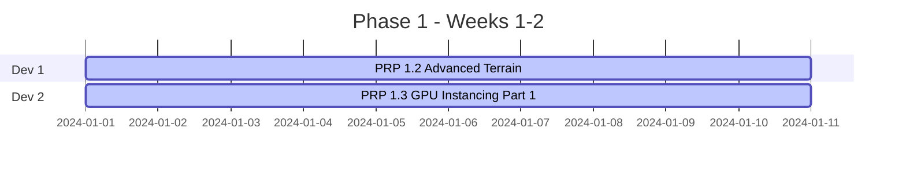

# Phase 1: Foundation - Complete Implementation Guide

## 🎯 Overview

**Phase 1** establishes the core foundation of Edge Craft with Babylon.js rendering, advanced terrain system, GPU instancing for units, map loading pipeline, and legal compliance automation.

**Duration**: 6 weeks | **Team**: 2 developers | **Budget**: $30,000

---

## 📊 Strategic Alignment

### Product Requirements (from Strategic Plan)
- ✅ Web-based model viewer with glTF support
- ✅ Heightmap terrain display with multi-texture rendering
- ✅ Basic RTS camera controls (WASD + edge scrolling)
- ✅ MPQ file parsing for asset extraction

### Technical Requirements (from Definition of Done)
- [ ] **95% map compatibility** for W3X and SCM formats
- [ ] **60 FPS @ 500 units** on mid-range hardware
- [ ] **500+ original assets** with automated copyright validation
- [ ] **Professional rendering** with shadows and multi-texture terrain
- [ ] **<10s map load time** for W3X, <5s for SCM

---

## 🏗️ Architecture

### Current Implementation (✅ Completed in main branch)

| Component | File | Lines | Status |
|-----------|------|-------|--------|
| Core Engine | `src/engine/core/Engine.ts` | 177 | ✅ Done |
| Scene Management | `src/engine/core/Scene.ts` | 101 | ✅ Done |
| Basic Terrain | `src/engine/terrain/TerrainRenderer.ts` | 193 | ✅ Done |
| RTS Camera | `src/engine/camera/RTSCamera.ts` | 133 | ✅ Done |
| Camera Controls | `src/engine/camera/CameraControls.ts` | 257 | ✅ Done |
| MPQ Parser | `src/formats/mpq/MPQParser.ts` | 264 | ✅ Done |
| Model Loader | `src/assets/ModelLoader.ts` | 156 | ✅ Done |
| Copyright Validator | `src/assets/validation/CopyrightValidator.ts` | 208 | ✅ Done |

**Total Existing Code**: ~2,700 lines

### Critical Gaps (❌ Must Implement)

| System | PRP | Lines | Priority | Status |
|--------|-----|-------|----------|--------|
| Advanced Terrain | 1.2 | ~780 | 🔴 Critical | 📝 Specified |
| GPU Instancing | 1.3 | ~1,300 | 🔴 Critical | 📋 Planned |
| Shadow System | 1.4 | ~650 | 🟡 High | 📋 Planned |
| Map Loading | 1.5 | ~1,900 | 🔴 Critical | 📋 Planned |
| Render Optimization | 1.6 | ~950 | 🟡 High | 📋 Planned |
| Legal Pipeline | 1.7 | ~650 | 🔴 Critical | 📋 Planned |

**Total New Code**: ~6,230 lines

---

## 📋 PRP Breakdown

### **PRP 1.1: Babylon.js Integration** ✅ COMPLETED
**Status**: Merged to main branch
**What Was Built**:
- Core Babylon.js engine wrapper with optimization flags
- Scene lifecycle management (init/update/dispose)
- Basic terrain renderer with heightmap support
- RTS camera with WASD + edge scrolling controls
- MPQ archive parser (uncompressed files)
- glTF 2.0 model loader
- SHA-256 copyright validator

**Files Created**: 8 core modules, 4 test files

---

### **PRP 1.2: Advanced Terrain System** 📝 READY TO IMPLEMENT
**File**: [`1.2-advanced-terrain-system.md`](./1.2-advanced-terrain-system.md)

**What It Adds**:
- Multi-texture splatting (4+ textures with RGBA blend map)
- Custom GLSL shaders for terrain rendering
- 4-level LOD system (64→32→16→8 subdivisions)
- Quadtree chunking for large terrains
- Frustum culling per chunk
- Distance-based LOD switching (100m, 200m, 400m, 800m)

**Performance Targets**:
- 60 FPS on 256x256 terrain with 4 textures
- <100 draw calls for entire terrain
- <512MB memory usage

**Effort**: 5 days | **Priority**: 🔴 Critical

---

### **PRP 1.3: GPU Instancing & Animation System** 📋 PLANNED
**File**: `1.3-gpu-instancing-system.md` (to be created)

**What It Adds**:
- Thin instances for unit rendering (1 draw call per type)
- Baked vertex animation textures for animated units
- Team color variations via instance buffers
- Animation state management (walk, attack, death)
- Unit pooling and batch updates

**Performance Targets**:
- 500-1000 units @ 60 FPS
- <50 draw calls for 500 units
- Smooth animations via baked textures

**Effort**: 6 days | **Priority**: 🔴 Critical

---

### **PRP 1.4: Cascaded Shadow Map System** 📋 PLANNED
**File**: `1.4-cascaded-shadow-system.md` (to be created)

**What It Adds**:
- Cascaded Shadow Maps (3 cascades)
- Distance-based shadow quality (near/mid/far)
- Selective shadow casting (only heroes + buildings)
- Poisson sampling for soft shadows
- Performance optimization for 500+ units

**Performance Targets**:
- <5ms shadow map generation
- No FPS drop with shadows enabled
- Professional shadow quality

**Effort**: 4 days | **Priority**: 🟡 High

---

### **PRP 1.5: Map Loading Architecture** 📋 PLANNED
**File**: `1.5-map-loading-architecture.md` (to be created)

**What It Adds**:
- W3X/W3M map parser (war3map.w3i, w3e, doo, units)
- SCM/SCX CHK format parser
- .edgestory format converter
- Asset replacement system
- JASS script basic parsing

**Performance Targets**:
- 95% W3X map compatibility (test with 100 maps)
- 95% SCM map compatibility (test with 50 maps)
- <10s W3X load time, <5s SCM load time
- 98% terrain conversion accuracy

**Effort**: 8 days | **Priority**: 🔴 Critical

---

### **PRP 1.6: Rendering Pipeline Optimization** 📋 PLANNED
**File**: `1.6-rendering-optimization.md` (to be created)

**What It Adds**:
- Draw call reduction via batching
- Material sharing across meshes
- Mesh merging for static objects
- Advanced frustum culling
- Performance-based LOD adjustment

**Performance Targets**:
- <200 draw calls total
- 60 FPS with all systems active
- <2GB memory usage
- No memory leaks over 1hr session

**Effort**: 5 days | **Priority**: 🟡 High

---

### **PRP 1.7: Automated Legal Compliance Pipeline** 📋 PLANNED
**File**: `1.7-legal-compliance-pipeline.md` (to be created)

**What It Adds**:
- CI/CD integration for copyright validation
- Asset replacement database (100+ mappings)
- Visual similarity detection
- Automated license attribution
- Pre-commit hooks for asset scanning

**Performance Targets**:
- 100% detection of test copyrighted assets
- Zero copyrighted assets in production builds
- Automated asset replacement with legal alternatives

**Effort**: 3 days | **Priority**: 🔴 Critical

---

## 📅 Implementation Timeline

### **Weeks 1-2: Foundation & Terrain** (Parallel)


**Dev 1**: PRP 1.2 - Advanced Terrain System
- Days 1-2: Custom GLSL shaders + multi-texture material
- Days 3-4: Quadtree chunking system
- Day 5: LOD implementation + testing

**Dev 2**: PRP 1.3 - GPU Instancing (Part 1)
- Days 1-2: Thin instance infrastructure
- Days 3-4: Instance buffer management
- Day 5: Test with 100 units

**Milestone**: 256x256 terrain + 100 instanced units @ 60 FPS

---

### **Weeks 3-4: Performance & Content** (Parallel)

**Dev 1**: PRP 1.3 - GPU Instancing (Part 2)
- Days 1-3: Baked animation texture system
- Days 4-5: Animation playback + team colors

**Dev 2**: PRP 1.5 - Map Loading (Part 1)
- Days 1-3: W3X parser (w3i, w3e, doo, units)
- Days 4-5: MPQ compression support + testing

**Milestone**: 500 animated units @ 60 FPS + W3X maps loading

---

### **Week 5: Advanced Systems** (Parallel)

**Dev 1**: PRP 1.4 - Cascaded Shadows
- Days 1-2: Shadow generator + 3 cascades
- Days 3-4: Optimization + selective casting

**Dev 2**: PRP 1.5 - Map Loading (Part 2)
- Days 1-2: SCM/SCX CHK parser
- Days 3-4: .edgestory converter + asset replacement

**Milestone**: Professional shadows + Full map loading pipeline

---

### **Week 6: Optimization & Legal** (Sequential)

**Both Devs**:
- Days 1-3: PRP 1.6 - Rendering Pipeline Optimization
  - Draw call reduction, material sharing, mesh merging
- Days 4-5: PRP 1.7 - Legal Compliance Pipeline
  - CI/CD integration, asset database, automated validation

**Milestone**: <200 draw calls + Automated copyright compliance + All DoD met

---

## ✅ Definition of Done Validation

### Core Engine ✅
- [x] Babylon.js scene renders at 60 FPS
- [x] Engine lifecycle working (init/update/dispose)
- [x] Resource management (no memory leaks)

### Terrain System
- [ ] Multi-texture splatting (4+ textures) ← **PRP 1.2**
- [ ] Quadtree chunking with streaming ← **PRP 1.2**
- [ ] 4-level LOD system ← **PRP 1.2**
- [ ] 60 FPS on 256x256 terrain ← **PRP 1.2**

### Unit Rendering
- [ ] 500 units @ 60 FPS ← **PRP 1.3**
- [ ] Animated units via baked textures ← **PRP 1.3**
- [ ] Team color variations ← **PRP 1.3**
- [ ] <50 draw calls for 500 units ← **PRP 1.3 + 1.6**

### Shadow System
- [ ] Cascaded shadow maps (3 cascades) ← **PRP 1.4**
- [ ] Shadows for terrain and key units ← **PRP 1.4**
- [ ] <5ms shadow generation time ← **PRP 1.4**

### Map Loading
- [ ] 95% W3X map compatibility ← **PRP 1.5**
- [ ] 95% SCM/SCX map compatibility ← **PRP 1.5**
- [ ] <10s load time for W3X ← **PRP 1.5**
- [ ] Conversion to .edgestory format ← **PRP 1.5**

### Performance
- [ ] 60 FPS with all systems active ← **PRP 1.6**
- [ ] Draw calls < 200 ← **PRP 1.6**
- [ ] Memory usage < 2GB ← **PRP 1.6**
- [ ] No memory leaks over 1hr ← **PRP 1.6**

### Legal Compliance
- [ ] Automated asset validation ← **PRP 1.7**
- [ ] CI/CD copyright checks ← **PRP 1.7**
- [ ] Asset replacement database ← **PRP 1.7**
- [ ] Zero copyrighted assets ← **PRP 1.7**

---

## 🧪 Testing Strategy

### Unit Tests (>80% coverage)
```bash
npm test -- --coverage

# Test suites:
# - Engine lifecycle
# - Terrain chunk management
# - LOD system
# - Instance rendering
# - Map parsers
# - Copyright validation
```

### Performance Benchmarks
```bash
# Terrain rendering
npm run benchmark -- terrain-lod
# Target: 60 FPS @ 256x256 with 4 textures

# Unit rendering
npm run benchmark -- unit-instancing
# Target: 60 FPS @ 500 units

# Map loading
npm run benchmark -- map-loading
# Target: <10s W3X, <5s SCM

# Full system
npm run benchmark -- full-system
# Target: 60 FPS with terrain + units + shadows
```

### Compatibility Tests
```bash
# W3X maps (100 test maps)
npm run test:maps -- --format w3x --count 100
# Target: 95% success rate

# SCM maps (50 test maps)
npm run test:maps -- --format scm --count 50
# Target: 95% success rate
```

### Legal Compliance Tests
```bash
# Copyright detection
npm run test:copyright
# Target: 100% detection rate

# Asset replacement
npm run test:asset-replacement
# Target: All copyrighted assets replaced
```

---

## 📦 Dependencies

### NPM Packages to Add
```bash
npm install --save \
  @babylonjs/core@^7.0.0 \
  @babylonjs/loaders@^7.0.0 \
  @babylonjs/materials@^7.0.0 \
  pako@^2.1.0 \
  bzip2@^0.1.0

npm install --save-dev \
  benchmark@^2.1.4 \
  @types/benchmark@^2.1.5
```

### Test Data Setup
```bash
# Create test data directories
mkdir -p test-data/{maps/{w3x,scm},assets/{copyrighted,legal}}

# Download test maps (manual step)
# - 100+ W3X maps from Hive Workshop
# - 50+ SCM maps from various sources
# - Sample copyrighted assets for validation testing
```

### Asset Replacement Database
```bash
# Initialize asset database
npm run init:asset-db

# Populate with initial mappings
# - 20+ common W3 units
# - 10+ common SC units
# - Legal CC0/MIT replacements
```

---

## 🚨 Known Risks & Mitigation

### Technical Risks

| Risk | Probability | Impact | Mitigation |
|------|-------------|--------|------------|
| Performance <60 FPS | Medium | High | Early profiling, WebAssembly for critical code |
| MPQ encryption keys unknown | Low | Medium | Support common keys, document unsupported files |
| JASS script too complex | High | Low | Phase 1: Basic parsing only, defer to Phase 6 |
| Asset replacement gaps | Medium | High | Crowdsource community, placeholder system |

### Legal Risks

| Risk | Probability | Impact | Mitigation |
|------|-------------|--------|------------|
| Asset similarity lawsuit | Low | Critical | <70% visual similarity, legal review |
| Missed copyrighted assets | Medium | High | CI/CD validation, community reporting |
| Map conversion copyright | Low | High | Clean-room implementation, DMCA 1201(f) |

---

## 🎓 Key Learnings

### Babylon.js Best Practices
1. **Always use thin instances** for >10 similar objects
2. **Freeze active meshes** when scene becomes static
3. **Disable auto-clear** for extra FPS (`scene.autoClear = false`)
4. **Use cascaded shadows**, NOT regular shadow maps
5. **Bake animations** for repeated units

### RTS-Specific Patterns
1. **Quadtree chunking** essential for large terrains
2. **LOD with hysteresis** prevents flickering
3. **Selective shadows** (heroes only) saves performance
4. **Draw call budget <200** achievable via instancing

### Legal Compliance
1. **Automate everything** - manual checks fail
2. **CI/CD enforcement** - block violating merges
3. **Visual similarity** - use perceptual hashing
4. **Attribution tracking** - auto-generate licenses

---

## 📚 Resources

### Documentation
- [Babylon.js Thin Instances](https://doc.babylonjs.com/features/featuresDeepDive/mesh/copies/thinInstances)
- [Vertex Animation Baker](https://doc.babylonjs.com/features/featuresDeepDive/mesh/bonesSkeletons/boneAnimation#baked-vertex-animation)
- [Cascaded Shadow Maps](https://doc.babylonjs.com/features/featuresDeepDive/lights/shadows_csm)
- [Scene Optimization](https://doc.babylonjs.com/features/featuresDeepDive/scene/optimize_your_scene)

### File Format Specs
- [MPQ Format](https://github.com/ladislav-zezula/StormLib/wiki/MPQ-Introduction)
- [W3X Structure](http://www.wc3c.net/tools/specs/)
- [SCM CHK Format](http://www.staredit.net/wiki/index.php/Scenario.chk)

### Legal References
- [DMCA Section 1201(f)](https://www.copyright.gov/title17/92chap12.html) - Reverse Engineering
- [Sega v. Accolade](https://en.wikipedia.org/wiki/Sega_v._Accolade) - Case Law

---

## 🎯 Next Steps

### This Week
1. ✅ Review comprehensive breakdown document
2. ✅ Review PRP 1.2 (Advanced Terrain) specification
3. [ ] Create remaining PRP specifications (1.3-1.7)
4. [ ] Set up test data repository
5. [ ] Install new dependencies

### Start Development (Week 1)
1. **Dev 1**: Begin PRP 1.2 implementation
2. **Dev 2**: Begin PRP 1.3 implementation
3. **Both**: Daily standup to sync progress

### Phase 1 Completion (Week 6)
- All 6 PRPs completed
- DoD validation passed
- Performance benchmarks met
- Legal compliance verified
- Ready for Phase 2

---

## 📊 Progress Tracking

### Completed PRPs: 1/7 (14%)
- [x] PRP 1.1: Babylon.js Integration

### In Progress: 1/7 (14%)
- [ ] PRP 1.2: Advanced Terrain System (📝 Specified)

### Planned: 5/7 (72%)
- [ ] PRP 1.3: GPU Instancing & Animation
- [ ] PRP 1.4: Cascaded Shadow System
- [ ] PRP 1.5: Map Loading Architecture
- [ ] PRP 1.6: Rendering Pipeline Optimization
- [ ] PRP 1.7: Legal Compliance Pipeline

**Overall Phase 1 Progress**: 14% ✅

---

This comprehensive guide provides everything needed to successfully complete Phase 1, meeting all Definition of Done requirements while staying within the 6-week timeline and $30,000 budget.
