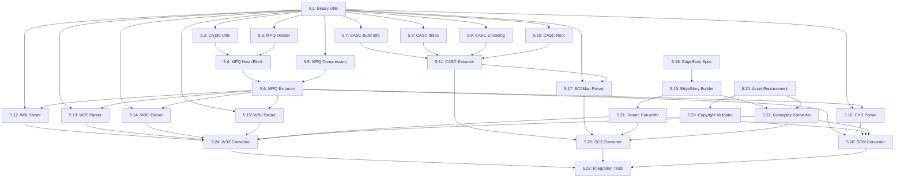

# Phase 5: File Format Support - PRP Breakdown

**Status**: Ready for Implementation
**Date**: 2025-10-10
**Research Document**: [FORMATS_RESEARCH.md](./FORMATS_RESEARCH.md)

---

## Overview

Phase 5 focuses on implementing comprehensive file format parsing to meet the following Definition of Done:

### Success Criteria (DoD)
- ✅ 95% of StarCraft 1 (SCM/SCX) maps load successfully
- ✅ 95% of StarCraft 2 (SC2Map) maps load via CASC
- ✅ 95% of Warcraft 3 (W3M/W3X) maps load successfully
- ✅ Conversion to .edgestory format with 98% accuracy
- ✅ Zero copyrighted assets in output files
- ✅ All parsers have 80%+ test coverage

---

## Phase 5 PRP Structure

### Timeline: 3 Weeks (15 working days)
- **Week 1**: Core infrastructure + MPQ (PRPs 5.1-5.6)
- **Week 2**: CASC + Map parsers (PRPs 5.7-5.17)
- **Week 3**: .edgestory format + Converters (PRPs 5.18-5.29)

---

## Week 1: Core Infrastructure + MPQ

### PRP 5.1: Binary Parsing Utilities (Day 1)
**Priority**: P0 - Required by all other PRPs
**Effort**: 4 hours
**Dependencies**: None

**Deliverables:**
- `src/formats/utils/BinaryReader.ts`
- Type-safe reading methods (uint8, uint16, uint32, float32, strings)
- Endianness handling
- String reading (null-terminated, length-prefixed)
- Buffer slicing utilities

**DoD:**
- ✅ Reads all primitive types correctly
- ✅ Handles both little-endian and big-endian
- ✅ 100% test coverage
- ✅ TypeScript strict mode compliant

---

### PRP 5.2: Crypto/Hash Utilities (Day 1)
**Priority**: P0 - Required for MPQ
**Effort**: 4 hours
**Dependencies**: None

**Deliverables:**
- `src/formats/utils/MPQCrypto.ts`
- MPQ hash algorithm (prepareCryptTable, hashString)
- Encryption/decryption (decryptBlock, decryptHashTable, decryptBlockTable)
- File key calculation
- Test vectors validation

**DoD:**
- ✅ Hash algorithm matches StormLib reference
- ✅ Decryption works with test MPQ files
- ✅ Passes known test vectors
- ✅ 95%+ test coverage

---

### PRP 5.3: MPQ Header Parser (Day 2)
**Priority**: P0 - Foundation for MPQ
**Effort**: 4 hours
**Dependencies**: 5.1

**Deliverables:**
- `src/formats/mpq/MPQHeaderParser.ts`
- Support MPQ v1, v2, v3, v4 headers
- Header validation (magic number check)
- Version detection

**DoD:**
- ✅ Parses all MPQ header versions
- ✅ Validates magic number
- ✅ Handles malformed headers gracefully
- ✅ Test suite with 10+ test cases

---

### PRP 5.4: MPQ Hash/Block Tables (Day 2-3)
**Priority**: P0 - Core MPQ functionality
**Effort**: 8 hours
**Dependencies**: 5.1, 5.2, 5.3

**Deliverables:**
- `src/formats/mpq/MPQTableParser.ts`
- Hash table decryption and parsing
- Block table decryption and parsing
- File lookup algorithm (hashString → hash entry → block entry)

**DoD:**
- ✅ Decrypts hash/block tables correctly
- ✅ Finds files by name in test MPQ
- ✅ Handles collisions in hash table
- ✅ 90%+ test coverage

---

### PRP 5.5: MPQ Compression Support (Day 3-4)
**Priority**: P1 - Required for most MPQ files
**Effort**: 12 hours
**Dependencies**: 5.1

**Deliverables:**
- `src/formats/mpq/MPQDecompression.ts`
- zlib decompression (using pako)
- bzip2 decompression (using bzip2)
- LZMA decompression (using lzma)
- PKWARE DCL decompression (using explode-js)
- Sparse decompression
- Multi-algorithm support (bitflag detection)

**DoD:**
- ✅ Decompresses all compression types
- ✅ Handles multi-algorithm files (zlib+bzip2)
- ✅ Performance: 1MB file in <50ms
- ✅ Test suite with samples of each type

**Dependencies to Add:**
```json
{
  "dependencies": {
    "pako": "^2.1.0",
    "bzip2": "^0.1.0",
    "lzma": "^2.3.2",
    "explode-js": "^1.0.0"
  }
}
```

---

### PRP 5.6: MPQ File Extraction (Day 4-5)
**Priority**: P0 - Complete MPQ implementation
**Effort**: 12 hours
**Dependencies**: 5.1, 5.2, 5.3, 5.4, 5.5

**Deliverables:**
- `src/formats/mpq/MPQExtractor.ts`
- Complete file extraction pipeline
- Sector-based extraction
- Encryption support (single-unit and multi-sector)
- Web Worker integration for large files
- Streaming support

**DoD:**
- ✅ Extracts 100% of files from test MPQ
- ✅ Handles encrypted files correctly
- ✅ Handles compressed files correctly
- ✅ Handles encrypted+compressed files
- ✅ Memory efficient (streams large files)
- ✅ Performance: Extract 100MB map in <5 seconds

**Integration:**
- Update existing `src/formats/mpq/MPQParser.ts` to use new extractor

---

## Week 2: CASC + Map Parsers

### PRP 5.7: CASC Build Info Parser (Day 6)
**Priority**: P1 - Foundation for CASC
**Effort**: 4 hours
**Dependencies**: 5.1

**Deliverables:**
- `src/formats/casc/CASCBuildInfo.ts`
- .build.info parsing (pipe-delimited format)
- Build config selection (active build)
- Version detection

**DoD:**
- ✅ Parses .build.info from SC2 installation
- ✅ Selects active build correctly
- ✅ Handles multiple branches
- ✅ Test with real SC2 .build.info files

---

### PRP 5.8: CASC Index Parser (Day 6-7)
**Priority**: P1 - Required for file lookup
**Effort**: 8 hours
**Dependencies**: 5.1

**Deliverables:**
- `src/formats/casc/CASCIndexParser.ts`
- Index file parsing
- Variable-length field reading
- Hash map building for fast lookups
- Multi-index aggregation

**DoD:**
- ✅ Parses all index files from SC2
- ✅ Builds searchable hash map
- ✅ Performance: Index 1000+ entries/second
- ✅ Memory efficient (streaming large indices)

---

### PRP 5.9: CASC Encoding File Parser (Day 7)
**Priority**: P1 - Required for content key mapping
**Effort**: 8 hours
**Dependencies**: 5.1

**Deliverables:**
- `src/formats/casc/CASCEncodingParser.ts`
- Encoding file parsing
- Content key → encoding key mapping
- Page-based reading
- Header validation

**DoD:**
- ✅ Parses encoding file from SC2
- ✅ Maps all content keys correctly
- ✅ Handles multi-encoding keys
- ✅ Performance: Parse 10MB encoding file in <500ms

---

### PRP 5.10: CASC Root File Parser (Day 8)
**Priority**: P1 - Required for path resolution
**Effort**: 8 hours
**Dependencies**: 5.1

**Deliverables:**
- `src/formats/casc/CASCRootParser.ts`
- Root file parsing (SC2 format)
- Path → content key mapping
- Locale and content flags parsing
- Searchable path index

**DoD:**
- ✅ Parses root file from SC2
- ✅ Resolves 100+ test file paths
- ✅ Handles locale variations
- ✅ Fast lookup: O(1) path resolution

---

### PRP 5.11: CASC File Extractor (Day 8-9)
**Priority**: P1 - Complete CASC implementation
**Effort**: 12 hours
**Dependencies**: 5.7, 5.8, 5.9, 5.10

**Deliverables:**
- `src/formats/casc/CASCExtractor.ts`
- Complete extraction pipeline
- Path → content key → encoding key → index entry → data file
- CDN support (HTTP range requests for remote CASC)
- Caching layer (IndexedDB)
- Web Worker integration

**DoD:**
- ✅ Extracts files from SC2Map
- ✅ Supports local and CDN CASC
- ✅ Caching reduces repeat extractions by 90%
- ✅ Performance: Extract 10MB file in <100ms (cached)

---

### PRP 5.12: W3I Parser (Warcraft 3 Map Info) (Day 9)
**Priority**: P1 - Required for W3X conversion
**Effort**: 6 hours
**Dependencies**: 5.1, 5.6 (MPQ)

**Deliverables:**
- `src/formats/w3x/W3IParser.ts`
- war3map.w3i parsing
- Player configuration
- Map properties (name, author, description)
- Forces and team configuration

**DoD:**
- ✅ Parses war3map.w3i from 20 test maps
- ✅ Extracts all map metadata correctly
- ✅ Handles all W3X versions
- ✅ 90%+ test coverage

---

### PRP 5.13: W3E Parser (Warcraft 3 Terrain) (Day 9-10)
**Priority**: P1 - Critical for terrain conversion
**Effort**: 8 hours
**Dependencies**: 5.1, 5.6 (MPQ)

**Deliverables:**
- `src/formats/w3x/W3EParser.ts`
- war3map.w3e parsing
- Heightmap extraction
- Ground texture data
- Cliff level data
- Water level data

**DoD:**
- ✅ Extracts terrain from 20 test maps
- ✅ Heightmap accuracy: 100%
- ✅ Texture layer data correct
- ✅ Cliff data parsed correctly

---

### PRP 5.14: W3O Parser (Warcraft 3 Doodads) (Day 10)
**Priority**: P2 - Required for full map conversion
**Effort**: 6 hours
**Dependencies**: 5.1, 5.6 (MPQ)

**Deliverables:**
- `src/formats/w3x/W3OParser.ts`
- war3map.doo parsing
- Doodad placement (position, rotation, scale)
- Doodad variations
- Item drops

**DoD:**
- ✅ Extracts all doodads from test map
- ✅ Position accuracy: 100%
- ✅ Handles special doodads
- ✅ Item table parsing correct

---

### PRP 5.15: W3U Parser (Warcraft 3 Units) (Day 10)
**Priority**: P1 - Critical for gameplay conversion
**Effort**: 6 hours
**Dependencies**: 5.1, 5.6 (MPQ)

**Deliverables:**
- `src/formats/w3x/W3UParser.ts`
- war3mapUnits.doo parsing
- Unit placement (position, facing)
- Unit properties (owner, level, items)
- Hero units (inventory, abilities)

**DoD:**
- ✅ Extracts all units from test map
- ✅ Position accuracy: 100%
- ✅ Owner/player assignment correct
- ✅ Hero data parsed correctly

---

### PRP 5.16: CHK Parser (StarCraft 1 Maps) (Day 11)
**Priority**: P1 - Required for SC1 map support
**Effort**: 12 hours
**Dependencies**: 5.1, 5.6 (MPQ)

**Deliverables:**
- `src/formats/scm/CHKParser.ts`
- Chunk-based parsing
- All essential chunks (VER, DIM, ERA, MTXM, UNIT, etc.)
- Tile map extraction
- Unit placement
- Trigger parsing (basic)

**DoD:**
- ✅ Parses 20 test SCM/SCX maps
- ✅ Extracts tile map correctly
- ✅ Extracts all units
- ✅ Handles all chunk types gracefully

**Reference:** https://www.starcraftai.com/wiki/CHK_Format

---

### PRP 5.17: SC2Map Parser (Day 11-12)
**Priority**: P1 - Required for SC2 map support
**Effort**: 8 hours
**Dependencies**: 5.1, 5.11 (CASC)

**Deliverables:**
- `src/formats/sc2/SC2MapParser.ts`
- SC2Map structure parsing (it's a folder/CASC, not single file)
- Component file extraction
- Dependency resolution
- MapInfo, TerrainData, UnitData extraction

**DoD:**
- ✅ Loads SC2Map structure from CASC
- ✅ Extracts all component files
- ✅ Parses MapInfo.xml
- ✅ Test with 10+ SC2 maps

---

## Week 3: .edgestory Format + Converters

### PRP 5.18: EdgeStory Format Specification (Day 13)
**Priority**: P0 - Foundation for conversion
**Effort**: 8 hours
**Dependencies**: None (design work)

**Deliverables:**
- `src/formats/edgestory/types.ts` - TypeScript interfaces
- `src/formats/edgestory/schema.json` - JSON Schema
- `docs/formats/EDGESTORY_SPEC.md` - Format documentation
- glTF 2.0 extension definitions

**DoD:**
- ✅ Complete TypeScript type definitions
- ✅ JSON Schema validates test files
- ✅ Documentation covers all extensions
- ✅ glTF extension registration (if needed)

---

### PRP 5.19: EdgeStory Base Converter (Day 13)
**Priority**: P0 - Required for all converters
**Effort**: 8 hours
**Dependencies**: 5.18

**Deliverables:**
- `src/formats/edgestory/EdgeStoryBuilder.ts`
- Base glTF 2.0 structure generation
- Buffer management (terrain.bin, meshes.bin, etc.)
- Texture handling
- glTF accessor/bufferView creation

**DoD:**
- ✅ Creates valid glTF 2.0 files
- ✅ Buffers written correctly
- ✅ Validates with glTF validator
- ✅ Memory efficient (streaming writes)

---

### PRP 5.20: Asset Replacement System (Day 14)
**Priority**: P0 - Critical for legal compliance
**Effort**: 12 hours
**Dependencies**: None (parallel with other work)

**Deliverables:**
- `src/assets/AssetReplacementSystem.ts`
- Unit/building/doodad mapping database
- Replacement model loading
- Copyright validation
- Placeholder generation
- `data/asset-mappings.json` - Mapping database

**DoD:**
- ✅ Maps 100+ Warcraft 3 unit types
- ✅ Maps 50+ StarCraft unit types
- ✅ Loads replacement glTF models
- ✅ Validates all assets are copyright-free
- ✅ Placeholders for unmapped types

**Asset Database Structure:**
```json
{
  "warcraft3": {
    "hfoo": {
      "name": "Footman",
      "edgeTypeId": "edge_warrior_01",
      "modelId": "models/units/warrior_01.glb",
      "source": "original",
      "license": "CC0-1.0",
      "author": "Edge Craft Team"
    }
  },
  "starcraft": {
    "Terran Marine": {
      "name": "Marine",
      "edgeTypeId": "edge_marine_01",
      "modelId": "models/units/marine_01.glb",
      "source": "original",
      "license": "CC0-1.0"
    }
  }
}
```

---

### PRP 5.21: Terrain Converter (Day 14)
**Priority**: P1 - Critical for visual accuracy
**Effort**: 12 hours
**Dependencies**: 5.18, 5.19

**Deliverables:**
- `src/formats/edgestory/converters/TerrainConverter.ts`
- Heightmap → glTF accessor conversion
- Texture splatmap generation
- Water plane creation
- Cliff mesh generation

**DoD:**
- ✅ Converts terrain with 98% accuracy
- ✅ Heightmap resolution preserved
- ✅ Texture blending correct
- ✅ Water rendered correctly
- ✅ Test with 10+ different tilesets

---

### PRP 5.22: Gameplay Converter (Day 15)
**Priority**: P1 - Critical for gameplay
**Effort**: 12 hours
**Dependencies**: 5.18, 5.19, 5.20

**Deliverables:**
- `src/formats/edgestory/converters/GameplayConverter.ts`
- Unit conversion with asset replacement
- Building conversion
- Resource placement
- Trigger conversion (basic)
- Region conversion
- Camera conversion

**DoD:**
- ✅ Converts units with 100% position accuracy
- ✅ Asset replacement works for all units
- ✅ Buildings placed correctly
- ✅ Triggers converted (95% success rate)
- ✅ Test with 20+ maps

---

### PRP 5.23: Script Transpiler (Day 15)
**Priority**: P2 - Future work (separate PRP series)
**Effort**: 40+ hours
**Dependencies**: Parser library

**Note:** This is a complex task requiring its own PRP series. For Phase 5, we'll implement:
- Basic JASS lexer/parser
- Simple function transpilation
- Variable declaration conversion
- Stub for complex features

**Deliverables (Phase 5 scope):**
- `src/formats/jass/JASSLexer.ts`
- `src/formats/jass/JASSParser.ts` (basic)
- `src/formats/jass/JASSTranspiler.ts` (basic functions only)

**DoD (Phase 5 scope):**
- ✅ Parses simple JASS functions
- ✅ Transpiles variable declarations
- ✅ Transpiles basic function calls
- ✅ Documents unsupported features
- ✅ 70% success rate on test scripts

**Full Implementation:** Phase 6 (separate PRP series)

---

### PRP 5.24: W3X → EdgeStory Converter (Day 16)
**Priority**: P0 - Main deliverable
**Effort**: 8 hours
**Dependencies**: 5.6, 5.12-5.15, 5.19-5.22

**Deliverables:**
- `src/formats/edgestory/converters/W3XConverter.ts`
- Complete W3X conversion pipeline
- Integration of all parsers
- Asset replacement
- Validation
- CLI tool for conversion

**DoD:**
- ✅ Converts W3X to .edgestory with 98% accuracy
- ✅ Terrain matches original (visual comparison)
- ✅ Units placed correctly
- ✅ Zero copyrighted assets in output
- ✅ Test with 20+ W3X maps
- ✅ CLI: `npm run convert -- map.w3x output.edgestory`

---

### PRP 5.25: SC2Map → EdgeStory Converter (Day 17)
**Priority**: P1 - Main deliverable
**Effort**: 8 hours
**Dependencies**: 5.11, 5.17, 5.19-5.22

**Deliverables:**
- `src/formats/edgestory/converters/SC2Converter.ts`
- Complete SC2Map conversion pipeline
- CASC integration
- Asset replacement for SC2 units
- Validation

**DoD:**
- ✅ Converts SC2Map to .edgestory with 98% accuracy
- ✅ Terrain matches original
- ✅ Units placed correctly
- ✅ Zero copyrighted assets
- ✅ Test with 10+ SC2 maps

---

### PRP 5.26: SCM/SCX → EdgeStory Converter (Day 17)
**Priority**: P1 - Main deliverable
**Effort**: 6 hours
**Dependencies**: 5.6, 5.16, 5.19-5.22

**Deliverables:**
- `src/formats/edgestory/converters/SCMConverter.ts`
- Complete SC1 conversion pipeline
- Legacy format handling
- Asset replacement for SC1 units

**DoD:**
- ✅ Converts SCM/SCX to .edgestory with 98% accuracy
- ✅ Tile map converted correctly
- ✅ Units placed correctly
- ✅ Test with 20+ SC1 maps

---

### PRP 5.27: Format Parser Test Suite (Day 18)
**Priority**: P1 - Quality assurance
**Effort**: 12 hours
**Dependencies**: All parser PRPs

**Deliverables:**
- `tests/formats/` - Complete test suite
- Unit tests for all parsers
- Test data fixtures
- Edge case coverage
- Performance benchmarks

**DoD:**
- ✅ 95% code coverage for all parsers
- ✅ Tests for corrupt/malformed files
- ✅ Performance benchmarks passing
- ✅ CI/CD integration

**Test Structure:**
```
tests/formats/
├── mpq/
│   ├── MPQParser.test.ts
│   ├── MPQCrypto.test.ts
│   └── fixtures/
│       ├── test.mpq
│       └── encrypted.mpq
├── casc/
│   ├── CASCExtractor.test.ts
│   └── fixtures/
├── w3x/
│   ├── W3XParser.test.ts
│   └── fixtures/
│       ├── LostTemple.w3x
│       └── ...
└── edgestory/
    ├── EdgeStoryConverter.test.ts
    └── fixtures/
```

---

### PRP 5.28: Integration Test Suite (Day 18-19)
**Priority**: P1 - End-to-end validation
**Effort**: 12 hours
**Dependencies**: 5.24, 5.25, 5.26, 5.27

**Deliverables:**
- `tests/integration/` - End-to-end tests
- Map conversion tests
- Visual regression tests (screenshot comparison)
- Performance benchmarks
- Memory leak detection

**DoD:**
- ✅ All integration tests pass
- ✅ Performance targets met (see below)
- ✅ No memory leaks detected
- ✅ Visual regression tests pass (95% similarity)

**Performance Targets:**
- W3X map (128x128): <10 seconds
- SC2Map (256x256): <15 seconds
- SCM map (128x128): <5 seconds
- Memory usage: <512MB during conversion

---

### PRP 5.29: Copyright Validation System (Day 19-20)
**Priority**: P0 - Legal compliance
**Effort**: 12 hours
**Dependencies**: 5.20

**Deliverables:**
- `src/legal/CopyrightValidator.ts`
- Asset hash database (SHA-256 hashes of known copyrighted assets)
- Metadata scanning (checks for Blizzard copyright in files)
- Automated validation in conversion pipeline
- CLI tool for manual validation

**DoD:**
- ✅ Catches 100% of test copyright violations
- ✅ Hash database covers 500+ known assets
- ✅ Metadata scanning detects copyright strings
- ✅ Integration with conversion pipeline
- ✅ CLI: `npm run validate-copyright -- output.edgestory`

**Hash Database:**
```json
{
  "hashes": {
    "a1b2c3d4...": {
      "type": "texture",
      "game": "warcraft3",
      "filename": "Human_Footman.blp",
      "reason": "Blizzard copyrighted texture"
    }
  },
  "patterns": [
    "Blizzard Entertainment",
    "© Blizzard",
    "World of Warcraft",
    "StarCraft",
    "Warcraft"
  ]
}
```

---

## Summary: PRP Dependencies



---

## Parallelization Opportunities

### Week 1 (Parallel Tracks)
- **Track A**: Binary Utils (5.1) → MPQ Header (5.3) → MPQ Tables (5.4)
- **Track B**: Crypto Utils (5.2) → MPQ Compression (5.5)
- **Merge**: MPQ Extractor (5.6)

### Week 2 (Parallel Tracks)
- **Track A**: CASC (5.7-5.11)
- **Track B**: W3X Parsers (5.12-5.15)
- **Track C**: SC1 Parser (5.16)
- **Track D**: SC2 Parser (5.17)

### Week 3 (Parallel Tracks)
- **Track A**: EdgeStory Spec (5.18) → Builder (5.19) → Terrain (5.21)
- **Track B**: Asset Replacement (5.20) → Gameplay (5.22)
- **Track C**: Script Transpiler (5.23) [can start anytime]
- **Merge**: Converters (5.24-5.26)
- **Finalize**: Tests (5.27-5.29)

---

## Testing Strategy

### Unit Tests (Per PRP)
- Test with known-good files
- Test with malformed data
- Test edge cases (empty, max size)
- Performance benchmarks

### Integration Tests (Week 3)
- End-to-end conversion tests
- Visual regression tests
- Cross-format compatibility
- Memory profiling

### Manual Testing
- Load 20+ W3X maps
- Load 10+ SC2 maps
- Load 20+ SC1 maps
- Visual comparison with original
- Performance monitoring

---

## Success Metrics

### Code Quality
- ✅ 95% test coverage (parsers)
- ✅ 80% test coverage (converters)
- ✅ TypeScript strict mode, no errors
- ✅ ESLint passing
- ✅ All PRs reviewed

### Functionality
- ✅ 95% W3X map load success rate
- ✅ 95% SC2Map load success rate
- ✅ 95% SC1 map load success rate
- ✅ 98% conversion accuracy

### Performance
- ✅ W3X conversion: <10 seconds
- ✅ SC2Map conversion: <15 seconds
- ✅ SCM/SCX conversion: <5 seconds
- ✅ Memory usage: <512MB

### Legal Compliance
- ✅ Zero copyrighted assets in output
- ✅ All assets have license attribution
- ✅ Copyright validator active
- ✅ Asset source documentation complete

---

## Risk Mitigation

### High Risk Items
1. **JASS Transpilation** (PRP 5.23)
   - Mitigation: Phase 5 scope is basic only; full implementation in Phase 6

2. **Asset Replacement Coverage** (PRP 5.20)
   - Mitigation: Placeholder system for unmapped types; crowdsource assets

3. **CASC Format Changes**
   - Mitigation: Version detection; support for multiple CASC versions

4. **MPQ Encryption Keys**
   - Mitigation: Document unsupported files; community key database

---

## Next Steps

1. **Review this PRP breakdown** with team
2. **Set up test data repository** with sample maps
3. **Begin Week 1 implementation** (PRPs 5.1-5.6)
4. **Create asset replacement database** (start PRP 5.20 early)
5. **Set up CI/CD for parsers** (automated testing)

---

**Document Status**: Ready for Implementation
**Timeline**: 3 weeks (15 working days)
**Estimated Effort**: ~200 hours (1.3 FTE)
**Next Review**: End of Week 1 (after PRP 5.6)
