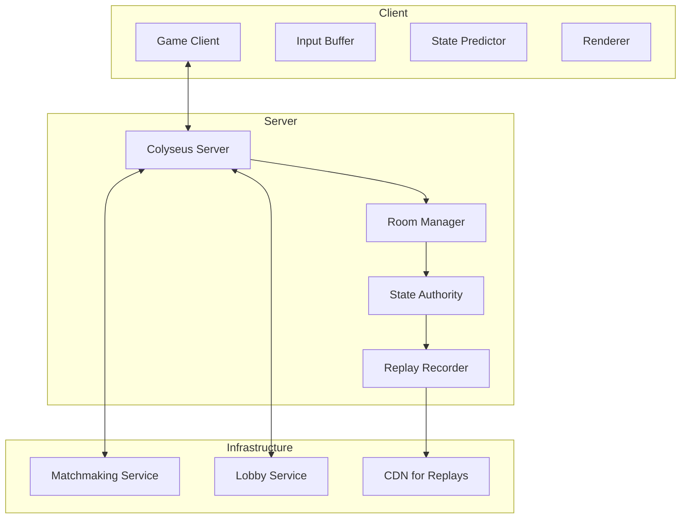

name: "Phase 4: Multiplayer Infrastructure"
description: |
  Implement real-time multiplayer support with Colyseus, including lobby system, deterministic simulation, and replay functionality.

## 🚨 CRITICAL: External Repository Dependency
**This PRP requires integration with the core-edge server:**
- **Repository**: https://github.com/uz0/core-edge
- **Purpose**: Authoritative multiplayer server implementation
- **Development**: Use mock server until core-edge integration
- **Documentation**: https://github.com/uz0/core-edge/wiki

## Goal
Create a robust multiplayer infrastructure that supports competitive RTS gameplay with low latency, deterministic simulation, and anti-cheat measures.

## Why
- **Core Feature**: Multiplayer is essential for RTS longevity
- **Community Building**: Enables competitive play and tournaments
- **Technical Excellence**: Demonstrates capability for real-time synchronization
- **Platform Value**: Differentiates from single-player map viewers

## What
Complete multiplayer system featuring:
- WebSocket-based networking with Colyseus (via core-edge)
- Lobby and matchmaking system (core-edge implementation)
- Deterministic lockstep simulation
- Replay recording and playback
- Anti-cheat and validation
- Observer mode with delay

### Success Criteria
- [ ] Support 2-12 players per game
- [ ] Network latency < 100ms on regional servers
- [ ] Zero desync in 100 test matches
- [ ] Replay files < 1MB for 30-minute games
- [ ] Matchmaking time < 30 seconds
- [ ] Observer mode with 2-minute delay
- [ ] Server handles 100 concurrent games
- [ ] Graceful handling of disconnections

## 🚀 GitHub CI/CD Integration

### Recommended GitHub Actions for Multiplayer
```yaml
# .github/workflows/multiplayer-integration.yml
name: Multiplayer Integration Tests

on:
  pull_request:
    paths:
      - 'src/networking/**'
      - 'src/config/external.ts'
  schedule:
    - cron: '0 */6 * * *'  # Every 6 hours

jobs:
  test-core-edge-integration:
    runs-on: ubuntu-latest

    steps:
      - name: Checkout Edge Craft
        uses: actions/checkout@v4

      - name: Clone Core-Edge Server
        run: git clone https://github.com/uz0/core-edge ../core-edge

      - name: Setup Core-Edge
        run: |
          cd ../core-edge
          npm ci
          npm run build

      - name: Start Core-Edge Server
        run: |
          cd ../core-edge
          npm run dev &
          echo $! > core-edge.pid
          sleep 10  # Wait for server startup

      - name: Run Integration Tests
        run: |
          npm ci
          npm run test:multiplayer

      - name: Load Testing
        run: |
          npx artillery run tests/load/multiplayer.yml

      - name: Stop Core-Edge
        if: always()
        run: kill $(cat core-edge.pid) || true

      - name: Report Results
        if: failure()
        uses: actions/github-script@v6
        with:
          script: |
            await github.rest.issues.createComment({
              issue_number: context.issue.number,
              owner: context.repo.owner,
              repo: context.repo.repo,
              body: '⚠️ Multiplayer integration tests failed. Check core-edge compatibility.'
            });
```

### Benefits of CI/CD for Multiplayer
- ✅ Automated integration testing with core-edge
- ✅ Load testing for concurrent connections
- ✅ Compatibility monitoring with external repo
- ✅ Early detection of breaking changes
- ✅ Performance regression prevention

## All Needed Context

### Documentation & References
```yaml
- url: https://github.com/uz0/core-edge
  why: PRIMARY - Core-edge multiplayer server repository

- url: https://github.com/uz0/core-edge/wiki
  why: Core-edge server documentation and API

- url: https://docs.colyseus.io/
  why: Colyseus framework documentation (used by core-edge)

- url: https://gafferongames.com/post/deterministic_lockstep/
  why: Deterministic lockstep networking pattern

- url: https://www.gabrielgambetta.com/client-server-game-architecture.html
  why: Client-server architecture for games

- url: https://developer.valvesoftware.com/wiki/Source_Multiplayer_Networking
  why: Advanced networking concepts and lag compensation
```

### Core-Edge Integration Setup
```bash
# Development Setup - Using Mock Server
npm run mock:server  # Runs local mock from mocks/multiplayer-server/

# Production Setup - Using Core-Edge
# 1. Clone core-edge repository
git clone https://github.com/uz0/core-edge ../core-edge
cd ../core-edge
npm install

# 2. Configure core-edge settings
cp .env.example .env
# Edit .env with your configuration

# 3. Run core-edge server
npm run dev  # Development mode
npm run start  # Production mode

# 4. Update Edge Craft client configuration
# src/config/external.ts
export const MULTIPLAYER_ENDPOINT = process.env.NODE_ENV === 'production'
  ? 'wss://core-edge.edgecraft.game'
  : 'ws://localhost:2567';
```

### Architecture Overview


### Implementation Tasks

#### Task 1: Client-Side Integration with Core-Edge
```typescript
// NOTE: Server implementation is in https://github.com/uz0/core-edge
// This is the CLIENT-SIDE integration code

// src/networking/MultiplayerClient.ts
import { Client } from 'colyseus.js';
import { getMultiplayerEndpoint } from '@/config/external';

export class MultiplayerClient {
  private client: Client;

  constructor() {
    const endpoint = getMultiplayerEndpoint();
    console.log(`Connecting to multiplayer server: ${endpoint}`);

    // Connect to core-edge server (or mock in development)
    this.client = new Client(endpoint);
  }

  async joinLobby(): Promise<Room> {
    try {
      // Join lobby room on core-edge server
      const room = await this.client.joinOrCreate('lobby');
      console.log('Connected to core-edge lobby');
      return room;
    } catch (error) {
      console.error('Failed to connect to core-edge:', error);
      throw error;
    }
  }
    this.setSimulationInterval((deltaTime) => {
      this.update(deltaTime);
    }, this.fixedTimeStep);

    // Handle player commands
    this.onMessage('command', (client, command) => {
      this.state.queueCommand(client.sessionId, command);
    });

    // Start replay recording
    this.startReplayRecording();
  }

  onJoin(client: Client, options: any) {
    console.log(`${client.sessionId} joined`);

    this.state.addPlayer(client.sessionId, {
      name: options.name,
      faction: options.faction,
      team: options.team
    });
  }

  update(deltaTime: number) {
    // Process all queued commands
    const commands = this.state.getCommandsForTick();

    commands.forEach(cmd => {
      this.validateAndExecute(cmd);
    });

    // Update game simulation
    this.state.simulate(deltaTime);

    // Record frame for replay
    this.recordFrame();
  }

  private validateAndExecute(command: Command): void {
    // Anti-cheat validation
    if (!this.isValidCommand(command)) {
      console.warn(`Invalid command from ${command.playerId}`);
      return;
    }

    // Execute command in deterministic order
    this.state.executeCommand(command);
  }

  private isValidCommand(command: Command): boolean {
    // Validate command is possible given current state
    const player = this.state.players.get(command.playerId);

    switch (command.type) {
      case 'MOVE_UNIT':
        return this.validateUnitMove(player, command);
      case 'BUILD':
        return this.validateBuild(player, command);
      case 'ATTACK':
        return this.validateAttack(player, command);
      default:
        return false;
    }
  }
}
```

#### Task 2: Deterministic Game State
```typescript
// server/src/GameState.ts
import { Schema, MapSchema, ArraySchema, type } from '@colyseus/schema';

export class Unit extends Schema {
  @type('string') id: string;
  @type('string') owner: string;
  @type('number') x: number;
  @type('number') y: number;
  @type('number') health: number;
  @type('string') unitType: string;
}

export class GameState extends Schema {
  @type('number') tick: number = 0;
  @type('number') gameTime: number = 0;
  @type({ map: Unit }) units = new MapSchema<Unit>();
  @type([Command]) commandQueue = new ArraySchema<Command>();

  private rng: DeterministicRNG;

  constructor() {
    super();
    // Use deterministic RNG with fixed seed
    this.rng = new DeterministicRNG(12345);
  }

  simulate(deltaTime: number): void {
    this.tick++;
    this.gameTime += deltaTime;

    // Update all units deterministically
    this.units.forEach(unit => {
      this.updateUnit(unit, deltaTime);
    });

    // Check victory conditions
    this.checkVictoryConditions();
  }

  private updateUnit(unit: Unit, deltaTime: number): void {
    // All calculations must be deterministic
    // Use fixed-point math or integer math where possible
    const speed = this.getUnitSpeed(unit.unitType);
    const movement = Math.floor(speed * deltaTime / 1000);

    // Apply movement
    if (unit.targetX !== undefined) {
      const dx = unit.targetX - unit.x;
      const dy = unit.targetY - unit.y;
      const distance = Math.sqrt(dx * dx + dy * dy);

      if (distance > movement) {
        unit.x += Math.floor((dx / distance) * movement);
        unit.y += Math.floor((dy / distance) * movement);
      } else {
        unit.x = unit.targetX;
        unit.y = unit.targetY;
      }
    }
  }
}
```

#### Task 3: Client-Side Prediction
```typescript
// src/networking/ClientPredictor.ts
export class ClientPredictor {
  private confirmedState: GameState;
  private predictedState: GameState;
  private pendingCommands: Command[] = [];
  private serverTick: number = 0;

  constructor() {
    this.confirmedState = new GameState();
    this.predictedState = new GameState();
  }

  // Called when player issues command
  predictCommand(command: Command): void {
    // Apply command to predicted state immediately
    this.predictedState.executeCommand(command);

    // Queue for server confirmation
    this.pendingCommands.push(command);

    // Send to server
    this.sendCommandToServer(command);
  }

  // Called when server state update arrives
  reconcile(serverState: GameState, serverTick: number): void {
    this.serverTick = serverTick;
    this.confirmedState = serverState.clone();

    // Remove acknowledged commands
    this.pendingCommands = this.pendingCommands.filter(
      cmd => cmd.tick > serverTick
    );

    // Rebuild predicted state from confirmed state
    this.predictedState = this.confirmedState.clone();

    // Re-apply pending commands
    this.pendingCommands.forEach(cmd => {
      this.predictedState.executeCommand(cmd);
    });
  }

  // Get interpolated state for rendering
  getRenderState(renderTime: number): GameState {
    // Interpolate between past states for smooth rendering
    const delay = 100; // 100ms interpolation delay
    const targetTime = renderTime - delay;

    return this.interpolateStates(targetTime);
  }
}
```

#### Task 4: Replay System
```typescript
// src/replay/ReplayRecorder.ts
export class ReplayRecorder {
  private frames: ReplayFrame[] = [];
  private metadata: ReplayMetadata;

  startRecording(gameInfo: GameInfo): void {
    this.metadata = {
      version: '1.0.0',
      timestamp: Date.now(),
      map: gameInfo.map,
      players: gameInfo.players,
      settings: gameInfo.settings
    };
    this.frames = [];
  }

  recordFrame(tick: number, commands: Command[]): void {
    // Only store commands, not full state (smaller file size)
    if (commands.length > 0) {
      this.frames.push({
        tick,
        commands: this.compressCommands(commands)
      });
    }
  }

  private compressCommands(commands: Command[]): CompressedCommands {
    // Compress commands for smaller replay files
    // Use delta encoding, bit packing, etc.
    return {
      data: this.packCommands(commands),
      count: commands.length
    };
  }

  async saveReplay(): Promise<ArrayBuffer> {
    const replay = {
      metadata: this.metadata,
      frames: this.frames
    };

    // Compress entire replay
    const json = JSON.stringify(replay);
    const compressed = await this.compress(json);

    return compressed;
  }
}

// src/replay/ReplayPlayer.ts
export class ReplayPlayer {
  private replay: Replay;
  private gameState: GameState;
  private currentFrame: number = 0;

  async loadReplay(buffer: ArrayBuffer): Promise<void> {
    const decompressed = await this.decompress(buffer);
    this.replay = JSON.parse(decompressed);

    // Initialize game state from replay metadata
    this.gameState = new GameState();
    this.initializeFromMetadata(this.replay.metadata);
  }

  step(): void {
    if (this.currentFrame >= this.replay.frames.length) {
      return;
    }

    const frame = this.replay.frames[this.currentFrame];
    const commands = this.unpackCommands(frame.commands);

    // Execute commands on game state
    commands.forEach(cmd => {
      this.gameState.executeCommand(cmd);
    });

    this.gameState.simulate(16.67); // One frame at 60 FPS
    this.currentFrame++;
  }

  seek(tick: number): void {
    // Reset and fast-forward to target tick
    this.currentFrame = 0;
    this.gameState = new GameState();
    this.initializeFromMetadata(this.replay.metadata);

    while (this.currentFrame < tick) {
      this.step();
    }
  }
}
```

#### Task 5: Matchmaking Service
```typescript
// server/src/MatchmakingService.ts
export class MatchmakingService {
  private queues: Map<string, MatchmakingQueue> = new Map();

  constructor() {
    // Initialize queues for different game modes
    this.queues.set('1v1', new MatchmakingQueue(2, 200)); // 200 ELO range
    this.queues.set('2v2', new MatchmakingQueue(4, 250));
    this.queues.set('3v3', new MatchmakingQueue(6, 300));
    this.queues.set('4v4', new MatchmakingQueue(8, 350));
  }

  async findMatch(player: Player, mode: string): Promise<Match> {
    const queue = this.queues.get(mode);
    if (!queue) {
      throw new Error(`Invalid game mode: ${mode}`);
    }

    return new Promise((resolve) => {
      queue.addPlayer(player, (match) => {
        resolve(match);
      });

      // Expand search range over time
      this.expandSearchRange(queue, player);
    });
  }

  private expandSearchRange(queue: MatchmakingQueue, player: Player): void {
    let expansions = 0;
    const maxExpansions = 5;

    const interval = setInterval(() => {
      if (expansions >= maxExpansions) {
        clearInterval(interval);
        return;
      }

      queue.expandRange(player, 50); // Add 50 ELO per expansion
      expansions++;
    }, 10000); // Every 10 seconds
  }
}

class MatchmakingQueue {
  private players: QueuedPlayer[] = [];

  constructor(
    private playersPerMatch: number,
    private baseEloRange: number
  ) {}

  addPlayer(player: Player, callback: (match: Match) => void): void {
    const queuedPlayer: QueuedPlayer = {
      player,
      callback,
      eloRange: this.baseEloRange,
      queueTime: Date.now()
    };

    this.players.push(queuedPlayer);
    this.attemptMatch();
  }

  private attemptMatch(): void {
    // Sort by queue time (FIFO with ELO consideration)
    this.players.sort((a, b) => a.queueTime - b.queueTime);

    for (let i = 0; i < this.players.length; i++) {
      const anchor = this.players[i];
      const candidates = this.findCandidates(anchor);

      if (candidates.length >= this.playersPerMatch - 1) {
        // Found enough players for a match
        this.createMatch([anchor, ...candidates]);
        return;
      }
    }
  }

  private findCandidates(anchor: QueuedPlayer): QueuedPlayer[] {
    const minElo = anchor.player.elo - anchor.eloRange;
    const maxElo = anchor.player.elo + anchor.eloRange;

    return this.players.filter(p =>
      p !== anchor &&
      p.player.elo >= minElo &&
      p.player.elo <= maxElo
    ).slice(0, this.playersPerMatch - 1);
  }
}
```

## Validation Loop

### Level 1: Unit Tests
```bash
# Test networking components
npm test -- --testPathPattern=networking

# Should cover:
# - Command serialization
# - State synchronization
# - Prediction/reconciliation
# - Replay compression
```

### Level 2: Integration Tests
```typescript
// tests/integration/multiplayer.test.ts
describe('Multiplayer', () => {
  let server: ColyseusTestServer;
  let client1: Client;
  let client2: Client;

  beforeAll(async () => {
    server = await createTestServer();
    client1 = await connectClient(server);
    client2 = await connectClient(server);
  });

  it('maintains sync between clients', async () => {
    const room = await client1.joinOrCreate('game_room');
    await client2.join(room.id);

    // Both clients move units
    client1.send('command', { type: 'MOVE_UNIT', unitId: '1', x: 100, y: 100 });
    client2.send('command', { type: 'MOVE_UNIT', unitId: '2', x: 200, y: 200 });

    await wait(100);

    // Verify both clients have same state
    expect(client1.state.units.get('1').x).toBe(100);
    expect(client2.state.units.get('1').x).toBe(100);
    expect(client1.state.units.get('2').x).toBe(200);
    expect(client2.state.units.get('2').x).toBe(200);
  });
});
```

### Level 3: Stress Testing
```bash
# Run stress test with multiple clients
npm run test:stress -- --clients=100 --duration=300

# Metrics to validate:
# - No memory leaks
# - CPU usage < 80%
# - Network latency < 100ms
# - Zero desyncs
```

## Final Validation Checklist
- [ ] Colyseus server handles 100 concurrent games
- [ ] Deterministic simulation verified across clients
- [ ] Replay files accurately reproduce games
- [ ] Matchmaking finds games in < 30 seconds
- [ ] Graceful disconnection handling
- [ ] Anti-cheat catches invalid commands
- [ ] Observer mode works with delay
- [ ] Network usage < 10KB/s per client
- [ ] Server auto-scales under load

## Anti-Patterns to Avoid
- ❌ Don't use floating-point for game logic
- ❌ Don't trust client state
- ❌ Don't send full state every frame
- ❌ Don't use wall-clock time for simulation
- ❌ Don't allow clients to directly modify state

## Confidence Score: 8/10

High confidence due to:
- Proven Colyseus framework
- Well-understood lockstep pattern
- Clear anti-cheat strategies

Challenges:
- Determinism across JavaScript engines
- Lag compensation complexity
- Scale testing requirements